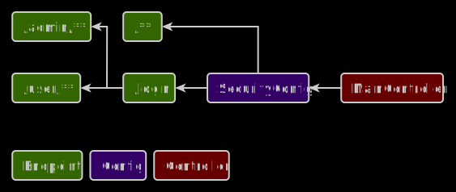

# Authorization

## Description
A simple web application that implements In-Memory Authentication and allows you to pass authorization.

## Used tools
* Platform: Spring Boot 2.6.3
* Builder: Gradle
* Languages: Java 8, HTML5, JavaScript 1.7
* Dependencies: Spring Security, Thymeleaf, Spring Web

## Important files
* Builder configuration: /build.gradle
* Application properties: /src/main/resources/application.properties
* Security configuration: /src/main/java/web/auth/config/SecurityConfig.java

## Frontend and backend schema

## Installation
1. Run this project in a development environment
2. Open http://localhost:8080 in the browser

## Release notes
* Project type: Web application
* Date of release: 15 February 2022
* Date of last update: 23 June 2023
* Current version: 2.1
